### Escuela Colombiana de Ingeniería
### Arquitecturas de Software - ARSW
## Ejercicio Introducción al paralelismo - Hilos - Caso BlackListSearch
#### AUTORES:
- [Saray Mendivelso](https://github.com/saraygonm)
- [Milton Gutierrez](https://github.com/MiltonGutierrez)

### Dependencias:
####   Lecturas:
*  [Threads in Java](http://beginnersbook.com/2013/03/java-threads/)  (Hasta 'Ending Threads')
*  [Threads vs Processes]( http://cs-fundamentals.com/tech-interview/java/differences-between-thread-and-process-in-java.php)

### Descripción
  Este ejercicio contiene una introducción a la programación con hilos en Java, además de la aplicación a un caso concreto.
  

**Parte I - Introducción a Hilos en Java**

##### 1. De acuerdo con lo revisado en las lecturas, complete las clases CountThread, para que las mismas definan el ciclo de vida de un hilo que imprima por pantalla los números entre A y B. 
   
##### 2. Complete el método __main__ de la clase CountMainThreads para que:
 1. Cree 3 hilos de tipo CountThread, asignándole al primero el intervalo [0..99], al segundo [99..199], y al tercero [200..299].

    Primero declaramos los parametros de inicio y fin del thread y definimos el ciclo para ejecutarlo en el rango que queremos junto con un constructor para finalizar los valores 
	   

	      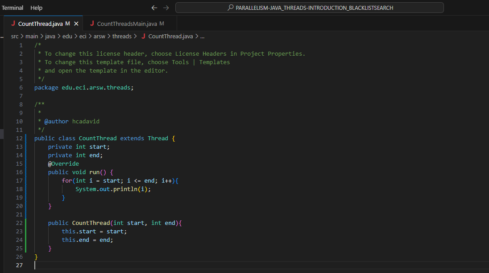
	   

    
3. Inicie los tres hilos con 'start()'.
	

	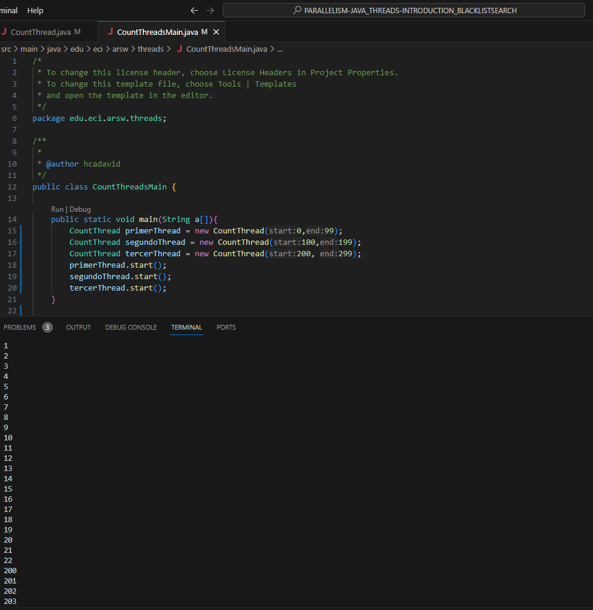
	

     
4. Ejecute y revise la salida por pantalla.
    
    Observamos euqe usando start() salen en desorden los valores del rango mientras que con run se ejecuta cada rango en orden 
5. Cambie el incio con 'start()' por 'run()'. Cómo cambia la salida?, por qué?.
    
    Al cambiarlo pudimos evidenciar que usando run los valores se imprimen en el orden que se declaro por thread, y esto ocurre debido a que mientras en run() se ejecuta en el mismo hilo la salida es secuencial a diferencia del start(), pues este  crea un nuevo hilo y ejecuta el método run() de manera concurrente, provocando un comportamiento de multithreading y haciendo que cambie el orden de salida.
	  

	   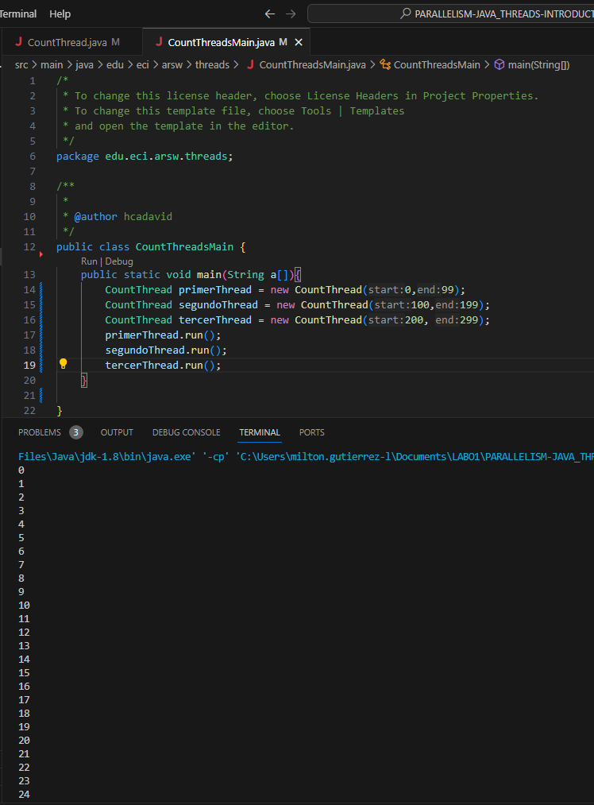
	  

**Parte II - Ejercicio Black List Search**

Para un software de vigilancia automática de seguridad informática se está desarrollando un componente encargado de validar las direcciones IP en varios miles de listas negras (de host maliciosos) conocidas, y reportar aquellas que existan en al menos cinco de dichas listas. 

Dicho componente está diseñado de acuerdo con el siguiente diagrama, donde:

- HostBlackListsDataSourceFacade es una clase que ofrece una 'fachada' para realizar consultas en cualquiera de las N listas negras registradas (método 'isInBlacklistServer'), y que permite también hacer un reporte a una base de datos local de cuando una dirección IP se considera peligrosa. Esta clase NO ES MODIFICABLE, pero se sabe que es 'Thread-Safe'.

- HostBlackListsValidator es una clase que ofrece el método 'checkHost', el cual, a través de la clase 'HostBlackListDataSourceFacade', valida en cada una de las listas negras un host determinado. En dicho método está considerada la política de que al encontrarse un HOST en al menos cinco listas negras, el mismo será registrado como 'no confiable', o como 'confiable' en caso contrario. Adicionalmente, retornará la lista de los números de las 'listas negras' en donde se encontró registrado el HOST.

Al usarse el módulo, la evidencia de que se hizo el registro como 'confiable' o 'no confiable' se dá por lo mensajes de LOGs:

INFO: HOST 205.24.34.55 Reported as trustworthy

INFO: HOST 205.24.34.55 Reported as NOT trustworthy

Al programa de prueba provisto (Main), le toma sólo algunos segundos análizar y reportar la dirección provista (200.24.34.55), ya que la misma está registrada más de cinco veces en los primeros servidores, por lo que no requiere recorrerlos todos. Sin embargo, hacer la búsqueda en casos donde NO hay reportes, o donde los mismos están dispersos en las miles de listas negras, toma bastante tiempo.

Éste, como cualquier método de búsqueda, puede verse como un problema [vergonzosamente paralelo](https://en.wikipedia.org/wiki/Embarrassingly_parallel), ya que no existen dependencias entre una partición del problema y otra.

Para 'refactorizar' este código, y hacer que explote la capacidad multi-núcleo de la CPU del equipo, realice lo siguiente:

1. Cree una clase de tipo Thread que represente el ciclo de vida de un hilo que haga la búsqueda de un segmento del conjunto de servidores disponibles. Agregue a dicha clase un método que permita 'preguntarle' a las instancias del mismo (los hilos) cuantas ocurrencias de servidores maliciosos ha encontrado o encontró.

   Primero que todo debimos crear una serie de atributos necesarios para poder conseguir el funcionamiento deseado como se muestra en la siguiente imagen, siendo *start* el el numero de la primera lista a revisar y *end* la ultima, adicionamente, la *ipaddress* a buscar y se añaden atributos que lleven el registro de tanto, las veces que se encontró la ip *ocurrencesCount*, las listas donde se encontró *blackListOcurrences* y por ultimo la cantidad de listas que se revisaron *checkedListCount*.
   	  

	   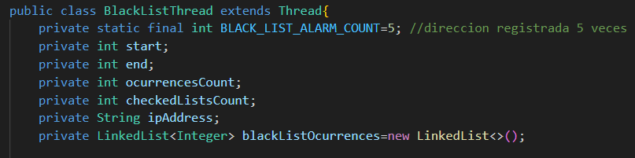
	  

   Adicionalmente, creamos un método contructor que permitiera instanciar un BlackListThread según los parámetros necesitados (start, end, ipaddress).
       	  

	   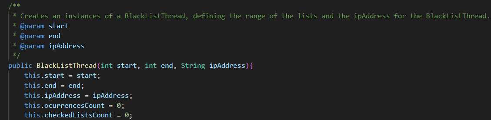
	  

   
   El sigiuente paso a seguir fue factorizar el método *run* en base al método *checkHost* de la clase **HostBlackListValidator** de la siguiente manera.
      	  

	   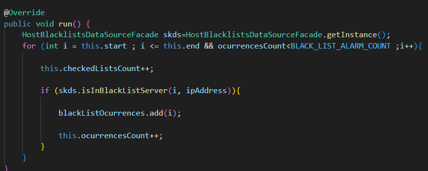
	  

   
   Finalmente creamos los métodos getters que permiten obtener los atributos necesarios para poder dar respuesta.
   	  

	   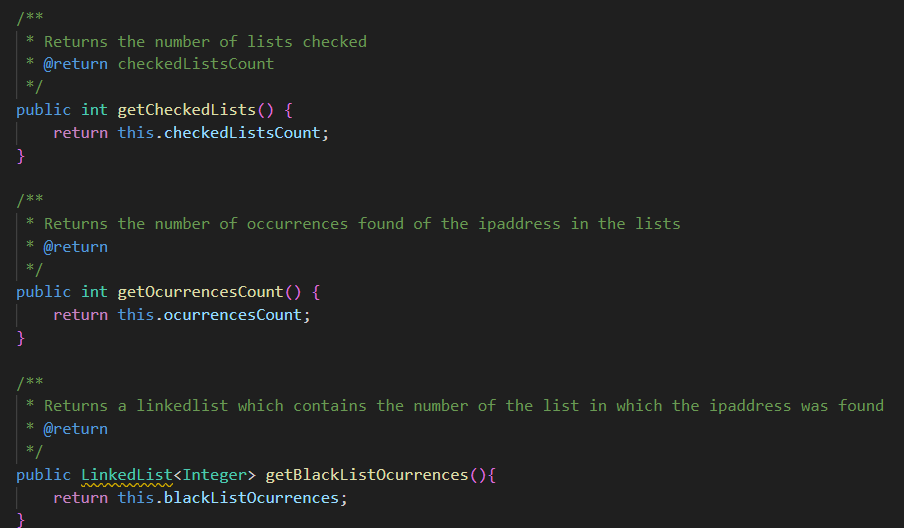
	  

   
3. Agregue al método 'checkHost' un parámetro entero N, correspondiente al número de hilos entre los que se va a realizar la búsqueda (recuerde tener en cuenta si N es par o impar!). Modifique el código de este método para que divida el espacio de búsqueda entre las N partes indicadas, y paralelice la búsqueda a través de N hilos. Haga que dicha función espere hasta que los N hilos terminen de resolver su respectivo sub-problema, agregue las ocurrencias encontradas por cada hilo a la lista que retorna el método, y entonces calcule (sumando el total de ocurrencuas encontradas por cada hilo) si el número de ocurrencias es mayor o igual a _BLACK_LIST_ALARM_COUNT_. Si se da este caso, al final se DEBE reportar el host como confiable o no confiable, y mostrar el listado con los números de las listas negras respectivas. Para lograr este comportamiento de 'espera' revise el método [join](https://docs.oracle.com/javase/tutorial/essential/concurrency/join.html) del API de concurrencia de Java. Tenga también en cuenta:

	* Dentro del método checkHost Se debe mantener el LOG que informa, antes de retornar el resultado, el número de listas negras revisadas VS. el número de listas negras total (línea 60). Se debe garantizar que dicha información sea verídica bajo el nuevo esquema de procesamiento en paralelo planteado.

	* Se sabe que el HOST 202.24.34.55 está reportado en listas negras de una forma más dispersa, y que el host 212.24.24.55 NO está en ninguna lista negra.

   Primero que todo procedimos a implementar un método **distributorOfIps** que nos creara el rango de ips a asignar a cada *BlackListThread* según el N dado. Inicialmente creamos una lista que tendra la cantidad total de listas que cada *BlackListThread* revisará, lo siguiente a realizar fue crear una arreglo de arreglos de numeros enteros que contendrá el rango de las listas a revisar para cada *BlackListThread*
      	  

	   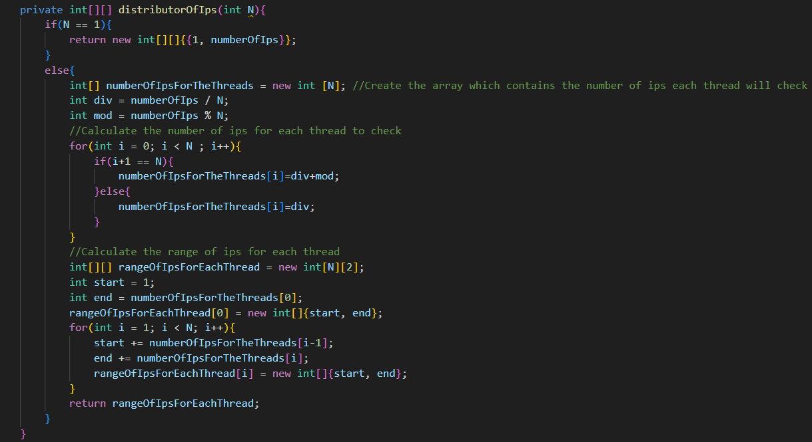
	  

   
   Lo siguiente fue refactorizar el método **checkHost()**, primero que todo se realiza la distribución de ips según nuestro N, para seguir con la instanciación de los N *BlackListsThreads* indicados, después se les indica a cada uno de estos que "empiecen" a ejectur sus calculos con el método **run()**, adicionalmente, a cada unos de estos se les indica con el método **join()** que deben esperar a que si existe algún Thread corriendo a que termine si ejecución, despues de esto se realiza el cálculo de la cantidad de listas checkeadas, la cantidad de veces que se encontró la ip y en qué listas. Para finalmente indicar si la naturaleza de la ip y el registro en el log.
	  

	   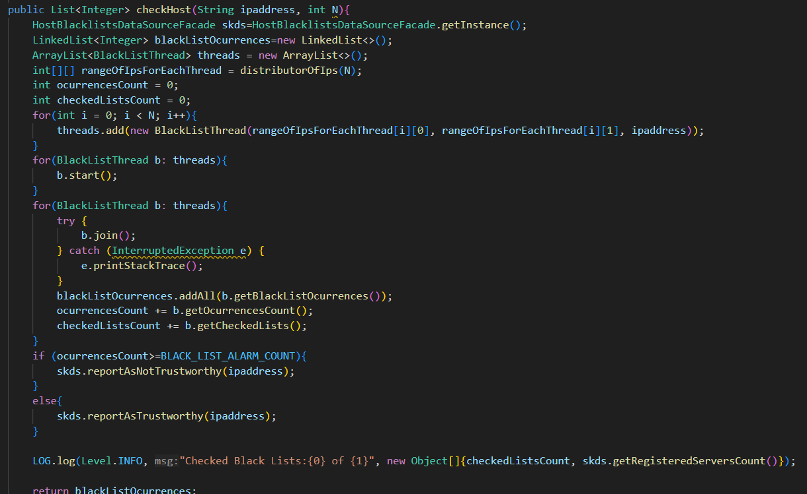
	  

**Parte II.I Para discutir la próxima clase (NO para implementar aún)**

La estrategia de paralelismo antes implementada es ineficiente en ciertos casos, pues la búsqueda se sigue realizando aún cuando los N hilos (en su conjunto) ya hayan encontrado el número mínimo de ocurrencias requeridas para reportar al servidor como malicioso. Cómo se podría modificar la implementación para minimizar el número de consultas en estos casos?, qué elemento nuevo traería esto al problema?
	
   * Se podría mejorar la estrategia del paralelismo por medio de la implementación un mecanismo de cancelación anticipada o bloqueos para los hilos, es decir cuando ya se obtengan la cantidad mínima de ocurrencias (maliciosas) requeridas, la búsqueda se detenga; logrando así optimizar en gran medida el tiempo de ejecución. 

   * Para llevar a cabo el ajuste anterior necesitaríamos como elemento nuevo una variable 'atómica' la cual se comparte entre hilos, los hilos usarían un método de interrupción ´Thread.interrupt()´al momento de cumplir la condición cerciorarnos de que los hilos verifiquen periódicamente el numero total de ocurrencias.

**Parte III - Evaluación de Desempeño**

A partir de lo anterior, implemente la siguiente secuencia de experimentos para realizar las validación de direcciones IP dispersas (por ejemplo 202.24.34.55), tomando los tiempos de ejecución de los mismos (asegúrese de hacerlos en la misma máquina):

Al iniciar el programa ejecute el monitor jVisualVM, y a medida que corran las pruebas, revise y anote el consumo de CPU y de memoria en cada caso. 

#### Para abrir el programa:
Una vez hemos descargado la carpeta
`.zip `, la extraemos y nos dirigimos a la subcarpeta `bin `, en donde encontraremos la aplicación.
	

	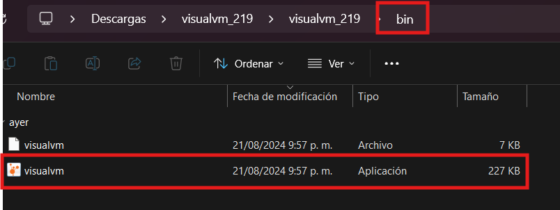
	

### 1. Un solo hilo.	
Ejecutamos nuestro programa con el fin de validar las direcciones IP dispersas en **un hilo**. Proceso el cual se lleva a cabo en una duración de 175818 milisegundos.
	

	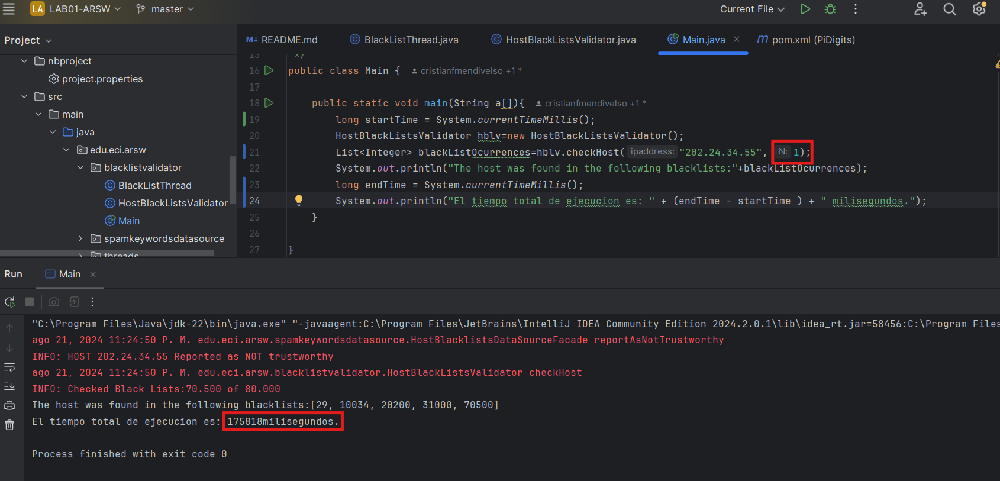
	

El monitor Java VisualVM  nos proporciona información sobre el uso de recursos de nuestro programa.
	

	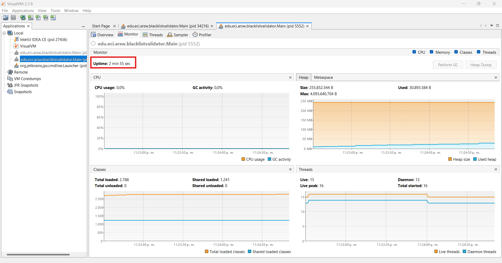
	

- **Uso de CPU:** 0%, indica que el programa está mayormente inactivo o en espera.
- **Actividad de GC:** 0%, sugiere que no se han realizado recolecciones de basura recientes, por lo que la memoria está bajo control.
- **Heap Metaspace:** De 255 MB, se utilizan aproximadamente 30 MB, mostrando bajo uso de memoria para clases y metadatos.
- **Clases:** 2,788 clases cargadas, ninguna descargada, con uso constante de las clases.
- **Hilos:** 15 activos (máximo de 16), la mayoría son hilos de soporte, con un número estable sin fluctuaciones significativas.

- Se concluye que el programa no está realizando una cantidad significativa de procesamiento en ese momento. Los recursos (CPU, memoria, e hilos) están estables, sin picos, lo cual podría indicar un estado en el que los hilos están en espera o el sistema está en una fase de baja actividad.

### 2. Tantos hilos como núcleos de procesamiento (haga que el programa determine esto haciendo uso del [API Runtime](https://docs.oracle.com/javase/7/docs/api/java/lang/Runtime.html)).
Para saber los núcleos de procesamiento en nuestro pc  nos dirigimos a nuestro administrador de tareas  y ejecutamos el siguiente comando
	

	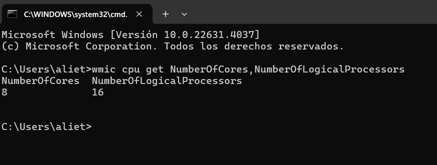
	

Cambiamos nuestro número de hilos por 8 y el tiempo de ejecución se redujó significativamente a 12961 milisegundos.
	

	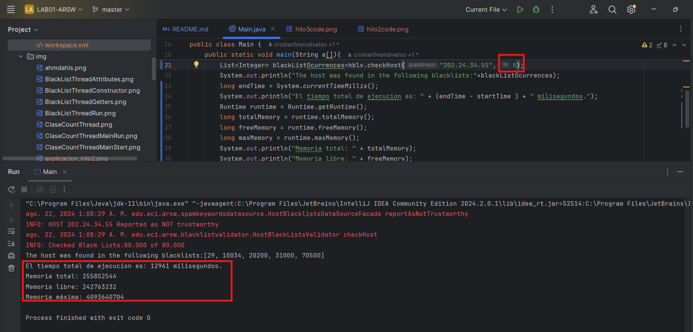
	

En cuanto al uso de recursos: 
	

	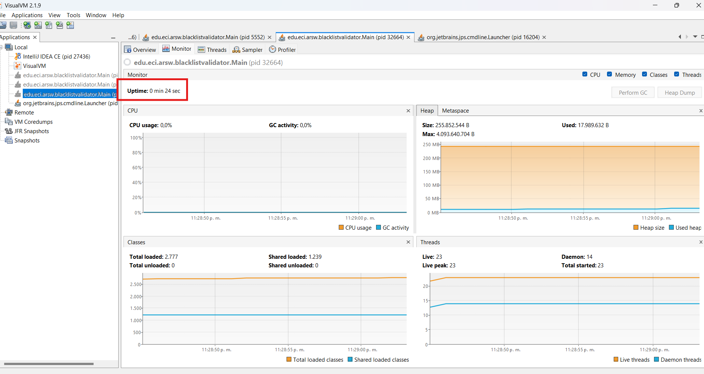
	

- **Uso de CPU:** 0%, sin carga significativa, es decir  inactividad o espera de los hilos.
- **Actividad de GC:** Ninguna, lo que indica que no se ha liberado memoria recientemente.
- **Heap Metaspace:** Uso reducido a 17 MB de 255 MB, indicando menor carga de metadatos.
- **Clases:** 2,777 clases cargadas, sin cambios significativos en las clases descargadas.
- **Hilos:** Aumento a 23 hilos activos (máximo de 23), con 14 hilos demonio, indicando que el programa gestiona más tareas simultáneas.

- Se infiere que el programa ha lanzado más hilos y tiene una menor carga de memoria en la Metaspace. Sin embargo, sigue sin realizar un procesamiento intenso, lo que se refleja en el bajo uso de CPU y la ausencia de actividad en el recolectar basura.

### 3. Tantos hilos como el doble de núcleos de procesamiento.
El número de hilos se duplica en relación con el  anterior a 16 y el tiempo de ejecución baja a 5839 milisegundos.
	

	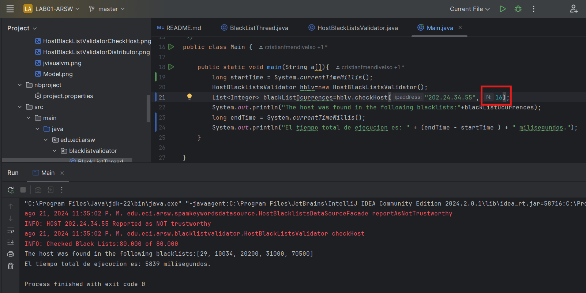
	

En cuanto al uso de recursos:
	

	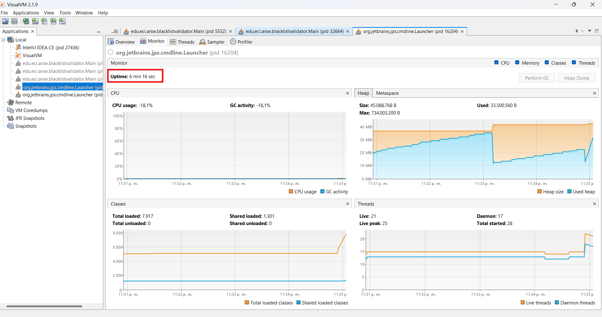
	

- **Uso de CPU:** Valor negativo (-18.1%), la carga de CPU es mínima o mal registrada.
- **Actividad de GC:** Aumento al 18.1%,  el programa está liberando memoria de forma más activa.
- **Heap Metaspace:** De 45 MB, se utilizan 33 MB. Hay un aumento en el uso de memoria con fluctuaciones observadas.
- **Clases:** 7,917 clases cargadas, mucho más que en los hilos anteriores, sin clases descargadas.
- **Hilos:** 21 activos (pico de 25), con 17 hilos demonio, mostrando un patrón dinámico y fluctuante.
 

- El programa está gestionando más memoria e hilos, con un aumento en la carga de clases y una mayor actividad de recolección de basura, sugiriendo tareas más complejas y cambios dinámicos en el sistema.

### 4. 50 hilos.
Con un tiempo de ejecución de 1934 milisegundos.

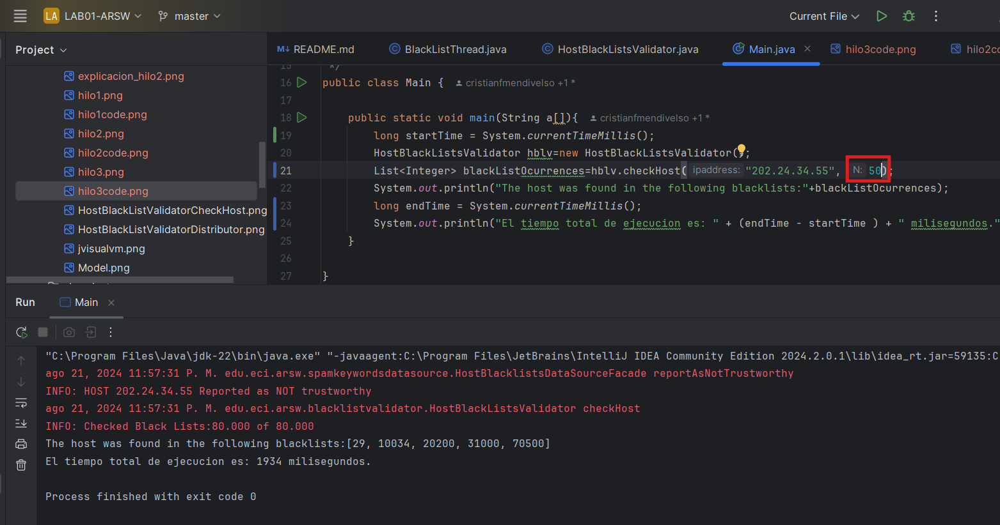

En cuanto al uso de recursos:
	

	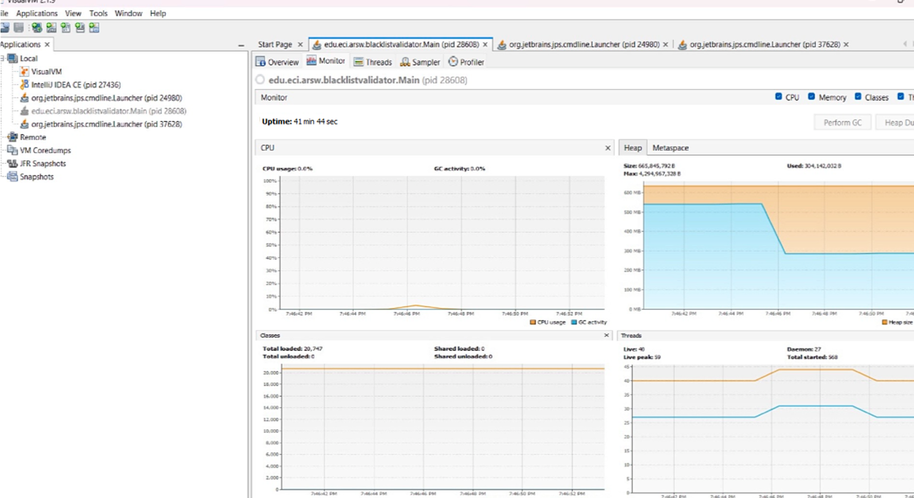
	

- **Uso de CPU:** ses bajo, es decir la aplicación no está realizando operaciones intensivas.
- **Actividad de GC:** se ha liberado memoria. La falta de actividad en la gráfica de "GC activity" sugiere que la liberación de memoria ocurrió de forma natural
- **Heap Metaspace:** Disminución del uso de la memoria heap
- **Clases:** El número de clases cargadas se mantiene constante
- **Hilos:** Reducción ligera en el número de hilos activos de 42 a 40 y en hilos daemon de 29 a 27. 

-  Esto podría reflejar una fase ociosa o la finalización de tareas ligeras, manteniendo la aplicación en un estado estable sin signos de estrés.

### 5. 100 hilos.
Con un tiempo de ejecución de 1055 milisegundos.

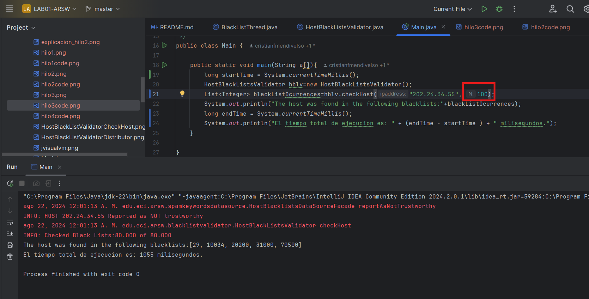

En cuanto al uso de recursos:

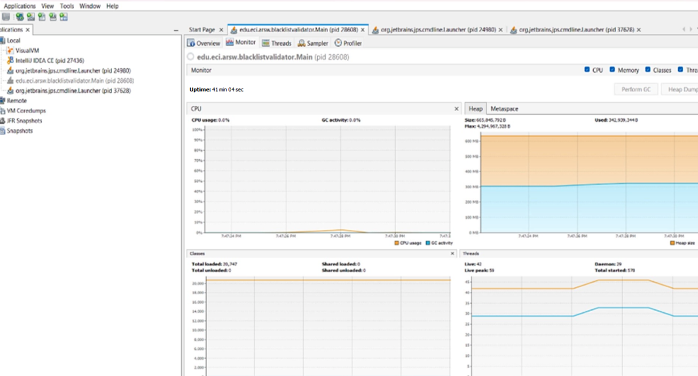

- **Uso de CPU:** Uso extremadamente bajo, cercano al 0%, la aplicación no está realizando operaciones intensivas en la CPU.
- **Actividad de GC:*** Utiliza aproximadamente 343. con poca o ninguna actividad de recolección de basura.
- **Heap Metaspace:** No muestra problemas de espacio o carga excesiva.
- **Clases:**  clases cargadas sin ninguna descargada, lo cual es normal para aplicaciones Java.
- **Hilos:**:  pico de 59 hilos, sin cambios significativos en el número de hilos.

- La aplicación parece estar en un estado estable, con bajo uso de CPU, utilización moderada de memoria, y un número constante de hilos, lo que sugiere que está en una fase de baja actividad o realizando tareas ligeras.

#### Con lo anterior, y con los tiempos de ejecución dados, haga una gráfica de tiempo de solución vs. número de hilos. Analice y plantee hipótesis con su compañero para las siguientes preguntas (puede tener en cuenta lo reportado por jVisualVM):

| Hilos (unidad) | Tiempo (milisegundos) |
|----------------|------------------------|
| 1              | 175818                 |
| 8              | 12961                  |
| 16             | 5839                   |
| 50             | 1934                   |
| 100            | 1055                   |

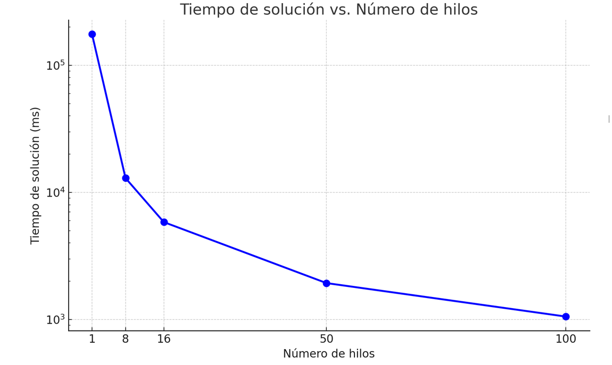

Se reafirma mediante el grafico que la ejecucion del problema se vuelve mucho más eficiente con un mayor número de hilos, o sea  el proceso puede beneficiarse significativamente de la paralelización.

**Parte IV - Ejercicio Black List Search**

1. Según la [ley de Amdahls](https://www.pugetsystems.com/labs/articles/Estimating-CPU-Performance-using-Amdahls-Law-619/#WhatisAmdahlsLaw?):

	, donde _S(n)_ es el mejoramiento teórico del desempeño, _P_ la fracción paralelizable del algoritmo, y _n_ el número de hilos, a mayor _n_, mayor debería ser dicha mejora. Por qué el mejor desempeño no se logra con los 500 hilos?, cómo se compara este desempeño cuando se usan 200?. 

	* Al analizar los resultados,  se evidencia que el tiempo de ejecución disminuye considerablemente al aumentar el número de hilos en las primeras etapas. Esto mejora el rendimiento del programa gracias a que se realiza la mayor  paralelización posible. 

   	Al seguir incrementando la cantidad de hilos, cuando llegan a cifras como 200 o 500, la mejora en el rendimiento se vuelve marginal. Esto se debe a que la ley de Amdahl establece un límite en la aceleración posible, debido a la porción secuencial del programa que no puede paralelizarse. 
    Como resultado, el tiempo de ejecución tiende a estabilizarse, alcanzando un punto en el que aumentar los hilos adicionales no aporta una reducción significativa en el tiempo.
   

2. Cómo se comporta la solución usando tantos hilos de procesamiento como núcleos comparado con el resultado de usar el doble de éste?.

	* Podríamos suponer que duplicar el número de hilos resultaría en una reducción a la mitad del tiempo de ejecución, pero en la práctica esto no ocurre de manera lineal. Al comparar el rendimiento utilizando tantos hilos como núcleos con el rendimiento al usar el doble de hilos, notamos que el aumento en el rendimiento es marginal. Al pasar de 8 a 16 hilos, el tiempo de ejecución no disminuye de manera significativa debido a factores como la sobrecarga en la gestión de hilos y la porción secuencial del programa, que limita la escalabilidad según lo establece la ley de Amdahl.

3. De acuerdo con lo anterior, si para este problema en lugar de 100 hilos en una sola CPU se pudiera usar 1 hilo en cada una de 100 máquinas hipotéticas, la ley de Amdahls se aplicaría mejor?. Si en lugar de esto se usaran c hilos en 100/c máquinas distribuidas (siendo c es el número de núcleos de dichas máquinas), se mejoraría?. Explique su respuesta.

	* Segun lo anterior sabemoos que el número de hilos tiene un impacto en el rendimiento, pero solo hasta un límite. Ejecutar un solo hilo en cada una de 100 máquinas resultaría ineficaz debido a la carga adicional de coordinación y comunicación. En cambio, asignar c hilos a 100/c máquinas (siendo c el número de núcleos) es más eficiente, ya que se aprovecha mejor la paralelización interna sin tanta sobrecarga. No obstante, la mejora aún está restringida por la porción secuencial del proceso.

